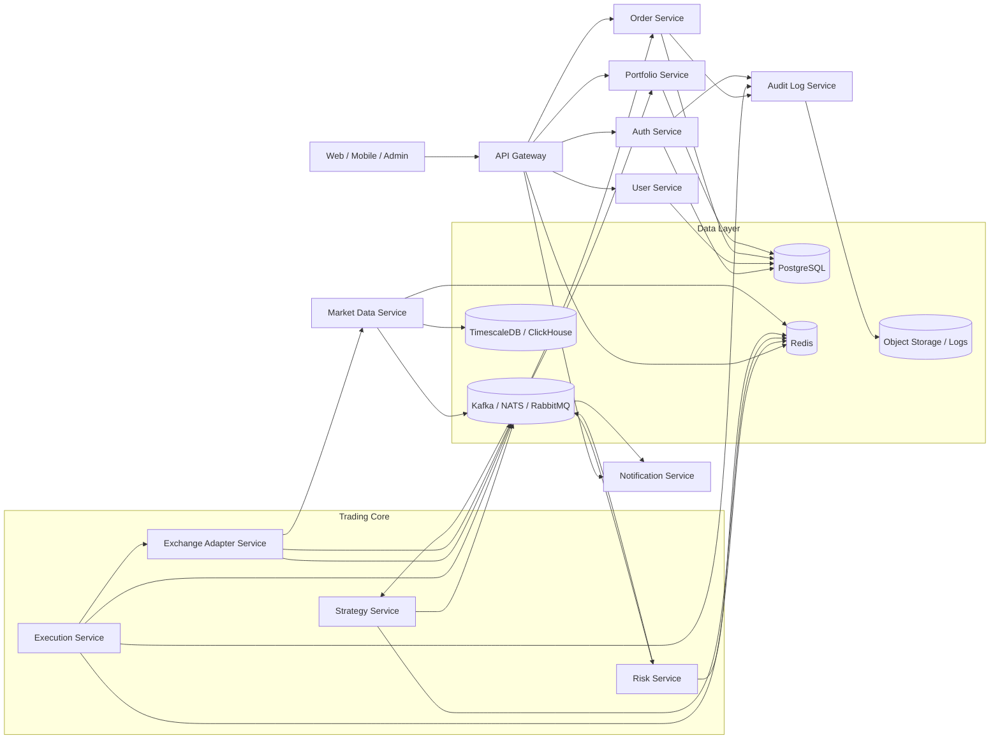

# Kiến trúc tổng thể cho microservice trading crypto bằng Go

## Mục tiêu
Hệ thống được thiết kế theo hướng event-driven microservices để tách biệt rõ trách nhiệm, dễ mở rộng, và dễ thay thế từng sàn giao dịch hoặc chiến lược giao dịch.

## Sơ đồ tổng quan



## Các lớp chính

### 1. Lớp truy cập
- API Gateway nhận request từ web, mobile, admin.
- Auth Service xử lý đăng nhập, JWT, phân quyền.
- User Service quản lý hồ sơ, cấu hình và trạng thái tài khoản.

### 2. Lớp giao dịch
- Strategy Service tạo tín hiệu mua/bán dựa trên dữ liệu thị trường.
- Risk Service kiểm tra hạn mức, exposure, stop loss, leverage.
- Order Service quản lý vòng đời lệnh.
- Execution Service gửi lệnh sang sàn và xử lý retry, idempotency.
- Exchange Adapter Service gom toàn bộ tích hợp Binance, Bybit, OKX, v.v.

### 3. Lớp dữ liệu và trạng thái
- Market Data Service thu thập giá, order book, candle, ticker.
- Portfolio Service tính số dư, vị thế, PnL.
- Notification Service phát cảnh báo qua email, Telegram, Slack, webhook.
- Audit Log Service lưu dấu vết thao tác và sự kiện quan trọng.

### 4. Hạ tầng hỗ trợ
- PostgreSQL lưu dữ liệu nghiệp vụ chính.
- Redis dùng cho cache, lock, rate limit, session ngắn hạn.
- Kafka, NATS hoặc RabbitMQ dùng để truyền sự kiện nội bộ.
- TimescaleDB hoặc ClickHouse phù hợp cho dữ liệu thị trường theo thời gian.
- Object storage hoặc log store lưu audit, file, snapshot.

## Luồng xử lý chính
1. Market Data Service lấy dữ liệu từ sàn và phát vào message broker.
2. Strategy Service tiêu thụ dữ liệu, sinh tín hiệu giao dịch.
3. Risk Service kiểm tra tín hiệu trước khi cho phép đặt lệnh.
4. Order Service tạo lệnh nội bộ và chuyển cho Execution Service.
5. Execution Service gọi Exchange Adapter Service để gửi lệnh thật lên sàn.
6. Portfolio Service và Notification Service cập nhật trạng thái sau khi lệnh khớp.

## Gợi ý MVP
Nếu muốn bắt đầu nhỏ, nên triển khai trước:
- API Gateway
- Auth Service
- Market Data Service
- Strategy Service
- Order Service
- Execution Service
- Exchange Adapter Service
- PostgreSQL, Redis, và một message broker

Sau đó mới mở rộng sang Portfolio, Risk, Notification, Audit và Reporting.

## Chi tiết từng service

### API Gateway
- Là điểm vào duy nhất cho client.
- Xử lý auth middleware, rate limit, request validation và routing.
- Có thể dùng gRPC nội bộ và HTTP/REST bên ngoài.

### Auth Service
- Quản lý đăng nhập, refresh token và phân quyền theo vai trò.
- Lưu token metadata, khóa phiên và trạng thái đăng nhập.

### User Service
- Quản lý thông tin người dùng, hồ sơ KYC và cấu hình cá nhân.
- Cung cấp preference cho ngôn ngữ, múi giờ và kênh nhận thông báo.

### Market Data Service
- Kết nối websocket hoặc REST tới các sàn.
- Chuẩn hóa dữ liệu ticker, order book, candle và trade stream.
- Phát event giá vào broker để các service khác tiêu thụ.

### Strategy Service
- Đọc market data và sinh tín hiệu theo từng chiến lược.
- Tách biệt logic chiến lược khỏi logic đặt lệnh.
- Hỗ trợ backtest hoặc paper trading về sau.

### Risk Service
- Kiểm tra margin, position size, max daily loss và exposure.
- Có quyền chặn lệnh trước khi đi tới Execution Service.

### Order Service
- Quản lý trạng thái nội bộ của lệnh: created, pending, filled, canceled, rejected.
- Gắn correlation id để theo dõi xuyên suốt toàn bộ vòng đời lệnh.

### Execution Service
- Chịu trách nhiệm gọi sang Exchange Adapter Service.
- Xử lý retry, timeout, idempotency và reconcile trạng thái.

### Exchange Adapter Service
- Đóng gói từng sàn thành adapter riêng.
- Giảm phụ thuộc của hệ thống vào format API từng sàn.

### Portfolio Service
- Cập nhật số dư, vị thế, PnL realized và unrealized.
- Là nguồn sự thật cho trạng thái tài sản của người dùng.

### Notification Service
- Nhận event từ broker và gửi email, Telegram, Slack hoặc webhook.
- Dùng template riêng theo loại sự kiện.

### Audit Log Service
- Lưu dấu vết cho các thao tác quan trọng như login, create order, cancel order và thay đổi cấu hình.
- Hữu ích cho truy vết sự cố và kiểm toán.

## Dữ liệu chính

### PostgreSQL
- users
- roles
- strategies
- orders
- executions
- portfolios
- audit_logs

### Redis
- cache giá gần nhất
- rate limit
- distributed lock
- session ngắn hạn

### Time-series store
- candles
- ticks
- order book snapshots
- market events

## Nguyên tắc thiết kế
- Mỗi service sở hữu dữ liệu của mình, không truy cập trực tiếp database của service khác.
- Giao tiếp ưu tiên event-driven để giảm coupling.
- Các thao tác đặt lệnh phải idempotent để tránh gửi trùng.
- Mọi event quan trọng nên có trace id và correlation id.
- Tích hợp sàn nên đi qua adapter, không để business logic phụ thuộc trực tiếp vào SDK của sàn.

## Triển khai đề xuất
- Dev: Docker Compose cho Go services, PostgreSQL, Redis và broker.
- Staging: Kubernetes với ingress, autoscaling và secret management.
- Production: tách riêng market data, execution và broker sang node ổn định hơn.

## Luồng dữ liệu mẫu
1. Market Data Service nhận giá mới từ sàn.
2. Strategy Service đọc event và phát tín hiệu.
3. Risk Service kiểm tra tín hiệu.
4. Order Service tạo order nội bộ.
5. Execution Service gửi order qua Exchange Adapter Service.
6. Portfolio Service cập nhật kết quả khớp lệnh.
7. Notification Service gửi thông báo cho người dùng.

## Phần nên làm tiếp
- Schema database chi tiết cho từng bảng.
- Danh sách event trong broker và payload mẫu.
- Cấu trúc thư mục Go cho từng service.
 - Thiết kế chi tiết cho từng thành phần và pattern sử dụng.

## Schema dữ liệu đề xuất

### users
- id
- email
- password_hash
- full_name
- status
- created_at
- updated_at

### roles
- id
- name
- description
- created_at

### user_roles
- user_id
- role_id

### strategies
- id
- user_id
- name
- type
- config_json
- status
- created_at
- updated_at

### market_symbols
- id
- exchange
- symbol
- base_asset
- quote_asset
- status

### orders
- id
- user_id
- strategy_id
- symbol_id
- side
- order_type
- quantity
- price
- status
- client_order_id
- exchange_order_id
- correlation_id
- created_at
- updated_at

### executions
- id
- order_id
- exchange
- exchange_trade_id
- fill_price
- fill_quantity
- fee
- fee_asset
- executed_at

### portfolios
- id
- user_id
- total_equity
- available_balance
- used_margin
- unrealized_pnl
- realized_pnl
- updated_at

### positions
- id
- portfolio_id
- symbol_id
- side
- quantity
- entry_price
- mark_price
- unrealized_pnl
- leverage
- updated_at

### audit_logs
- id
- user_id
- action
- entity_type
- entity_id
- metadata_json
- trace_id
- created_at

### notifications
- id
- user_id
- type
- channel
- title
- message
- status
- sent_at

## ERD chi tiết

ERD đã được tách sang [docs/erd-chi-tiet.md](docs/erd-chi-tiet.md) để dễ bảo trì và mở rộng.

## Event nội bộ mẫu

### market.price.updated
Khi Market Data Service nhận giá mới từ sàn.

```json
{
    "event_id": "uuid",
    "trace_id": "uuid",
    "exchange": "binance",
    "symbol": "BTCUSDT",
    "price": 65000.25,
    "bid": 64999.8,
    "ask": 65000.5,
    "ts": "2026-05-17T10:00:00Z"
}
```

### strategy.signal.generated
Khi Strategy Service tạo tín hiệu giao dịch.

```json
{
    "event_id": "uuid",
    "trace_id": "uuid",
    "strategy_id": "strat_001",
    "symbol": "BTCUSDT",
    "action": "buy",
    "confidence": 0.87,
    "reason": "ema_cross",
    "ts": "2026-05-17T10:00:01Z"
}
```

### risk.order.approved
Khi Risk Service chấp nhận tín hiệu để đặt lệnh.

```json
{
    "event_id": "uuid",
    "trace_id": "uuid",
    "signal_id": "uuid",
    "approved": true,
    "max_size": 0.5,
    "ts": "2026-05-17T10:00:02Z"
}
```

### order.created
Khi Order Service tạo lệnh nội bộ.

```json
{
    "event_id": "uuid",
    "trace_id": "uuid",
    "order_id": "ord_001",
    "user_id": "user_001",
    "symbol": "BTCUSDT",
    "side": "buy",
    "quantity": 0.5,
    "order_type": "market",
    "status": "created",
    "ts": "2026-05-17T10:00:03Z"
}
```

### execution.submitted
Khi Execution Service gửi lệnh sang sàn.

```json
{
    "event_id": "uuid",
    "trace_id": "uuid",
    "order_id": "ord_001",
    "exchange": "binance",
    "exchange_order_id": "ex_789",
    "status": "submitted",
    "ts": "2026-05-17T10:00:04Z"
}
```

### portfolio.updated
Khi Portfolio Service cập nhật số dư và vị thế.

```json
{
    "event_id": "uuid",
    "trace_id": "uuid",
    "user_id": "user_001",
    "symbol": "BTCUSDT",
    "position_qty": 0.5,
    "avg_entry_price": 65000.25,
    "unrealized_pnl": 12.4,
    "ts": "2026-05-17T10:00:05Z"
}
```

### notification.send.requested
Khi Notification Service được yêu cầu gửi thông báo.

```json
{
    "event_id": "uuid",
    "trace_id": "uuid",
    "user_id": "user_001",
    "channel": "telegram",
    "title": "Order filled",
    "message": "BTCUSDT buy order was filled",
    "ts": "2026-05-17T10:00:06Z"
}
```

## Hướng triển khai mã nguồn Go
- Mỗi service nên có package internal riêng cho handler, service, repository và domain.
- Common code nên đặt trong module riêng cho config, logger, observability và transport.
- Event schema nên version hóa để tránh phá vỡ các consumer hiện có.
- Order, execution và portfolio nên có test tích hợp vì đây là vùng rủi ro cao nhất.

## Bước tiếp theo hợp lý
- Viết cấu trúc thư mục Go cho toàn bộ hệ thống.
- Xây dựng ERD chi tiết từ schema ở trên.
- Định nghĩa contract API cho API Gateway và từng service nội bộ.