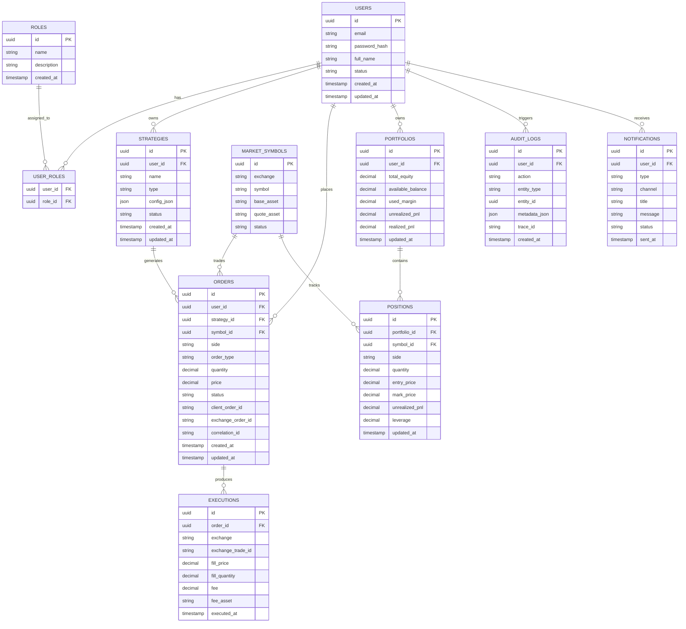

# ERD chi tiết cho hệ thống trading crypto

## Mục tiêu
ERD này mô tả các thực thể chính, khóa chính, khóa ngoại và quan hệ giữa các bảng phục vụ hệ thống microservice trading crypto bằng Go.

## ERD

## Ghi chú quan hệ
- USERS liên kết với ROLES qua USER_ROLES để hỗ trợ phân quyền nhiều-nhiều.
- USERS sở hữu STRATEGIES, ORDERS, PORTFOLIOS, AUDIT_LOGS và NOTIFICATIONS.
- STRATEGIES sinh ra ORDERS khi chiến lược tạo tín hiệu giao dịch.
- ORDERS có thể có nhiều EXECUTIONS nếu khớp nhiều lần.
- PORTFOLIOS chứa POSITIONS theo từng MARKET_SYMBOLS.
- AUDIT_LOGS giữ trace cho các thao tác nhạy cảm và có thể gắn với entity bất kỳ qua entity_type và entity_id.
